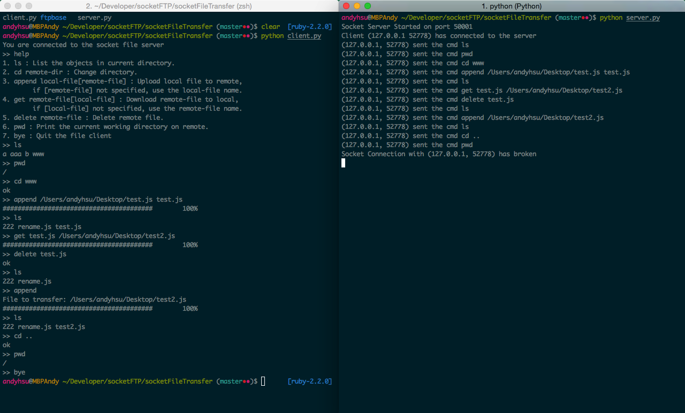

#Socket Programming Practice

- File Transfer Server & Client 
- Ftp Client

### File Transfer Server & Client

In this part, I implemented a pair of file transfer server and client without reading the ftp protocol, which turned out to be naive compared to the ftp. Still I learned much from this experience, about socket programming and pit falls.

Here is a brief introduction of my implementation.

#### Screenshot

#### Commands
- help
- ls
- cd remote-dir
- append local-file [remote-file]
- get remote-file [local-file]
- delete remote-file
- pwd
- bye

The server starts on a specified port, waiting for the clients to connect.
When clients successfully connect to the server, try the given commands to view, cd into or out of the server folders, to - upload or download the files, to - indicate the current working directory or delete files on the server, - or just say goodbye to the server.

####Here are some features supported:
- Varied length of message delivery by indication with a prefix.
- Multiple clients connection.
- If necessary, create the base directory for the file transfer server.
- Clients can never go out of the range of the base directory, spoiling the files on the server.
- Show process of uploading and downloading.
- Prompts for append/get commands.

### Ftp Client
Currently a prototype, connecting to an existing ftp server.

Todo: fully-fledged ftp client.